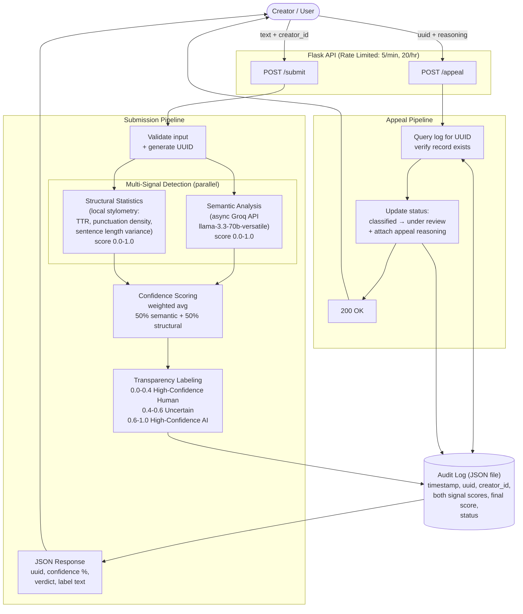

## Confidence Score & Transparency Label
    - A confidence score of 100% means it's completely AI.
    - A confidence score of 0 means, it's completely human. 
    - Uncertainty cases are between 40%-60%. 
### Labels:
    - High-Confidence Human: the system is confident that the content is created by a human. Scores from 0% to 40% is in this category. 
    - Uncertain: The system is not sure if the text is human created or AI generated. Confidence score between 40% and 60% is in this category.  
    - High-Confidence AI: the model is confident that the content is AI generated. Score from 60% to 100% is in this category. 

For more transparency, I will display the score to the user and explain what the confidence score is. A 65% confidence score is different than a 95% confidence score. 

## Signals

1. Semantic (context, tone, etc): semantic looks at the meaning, context of the text, and tone. A robotic sounding and uniform text is more robotic than human. However, a blindspot might text that are less emotion and written by expert writer that has clear structure and may look uniform. A stoic text might be misinterpreted as robotic or AI. 

2. Stylometruc heuristics: measures vocabulary diversity, punctuation density, or sentence length variation. A human written text may have less vocabulary diversity, more casual vocabulary, less usage of punctuation, and more length sentence variation as opposed to AI-generated text. The blind spots again might be professional writings written by experts, which has proper usage of punctuation and tend to have hard and diverse vocabularies.  

## Architecture
Required feature: 
(1) Content Submission Endpoint: The user submits a payload containing raw text and a creator_id to the /submit endpoint. 
    - POST to /submit endpoint (uses Flask Route)
    - the backend receives the payload, validates the input, and generate a uuid to track the text
(2) Multi-Signal Detection Pipeline: 
    - Semantic analysis: The raw text is passed to function that call Groq API using llama-3.3-70b-versatile model. The LLM evaluates the contex, tone, and sematics, and then returns a classification score between 0 and 1. 0 is human, and 1 is AI. The function should be asynchronous, so we could run another function for the structural signal
    - Structural Statistics: at the same time, a local Python module analyzes the text to calculate its stylometric heuristics. It should compute type token ratio to find vocabulary diversity, punctuation density, and sentence length variance. It calculates these metrics into a score between 0 and 1. 
(3) Confidence Scoring with Uncertainty:
    - The confidence score is sent to an aggregator system that calculates a weighted average giving 50% weight to LLM semantic and 50% weight to structural heuristics to produce a final confidence score. 
(4) Transparency Label:
    - the score is compared against the system's threshold. A score from 0.0 to 0.4.0 is high-confidence humman. A score between 0.4 and 0.6 is uncertain. The score from 0.6 to 1.0 is high-confidence AI. 
    - before sending the response to the user, the system should audit it 
    - The system should construct a JSON response contained the uuid, the confidence score (in percentage), the overall attibution verdict, and the plain-language transparency label text 
 (5) Audit Log:
    - Log the response before sending response to the user. The system should compile JSON strcutured entry containing the timestamp, uuid, creator_id, both signal scores separately, final combined score, and the intitial status ("classified"). This should be saved to a JSON file. 
 (6) Appeals Workflow:
    - endpoint: POST /appeal
    - a creator who believes they were misclassified submits a request containing the uuid and a string containing their reasoning
    - the backend queries the JSON file that the uuid exists to verify the original record exists. Then it should change the status from "classified" to "udner review" and add an appeals to the JSON object. 
    - Once complete, the system should return a 200 ok response to confirm that the appeal has been received. 

 (7) Rate Limiting
    - uses Flask limiter
    - the limits should allow real user to submit request without much interruption, prevent spam, and not flood the system and consume a lot of API calls.
        - The model llama-3.3-70b-versatile that I'm using has 30 requests per minute limit for free tier. 
        - Limit 1: 5 submission per minute sounds reasonable as a human won't probably enter more than 5 submission in a minute 
        - Limit 2: 20 submissions per hour to protect my free-tier API limits and so other users could also use it without breaking the pipeline. Too many calls will return an 429 error ("Too Many Requests") from Groq.
    
#### Submission Flow
    Post /submit --text--> Semantic Analysis --signal score--> Stylometric Heuristics --signal score--> Confidence Scoring --cobmbined score--> Transparency Labeling --label text--> Audit Log --label text--> Response 
#### Appeal Flow:
    POST /appeal --text--> Status Update --text--> Audit Log --200 ok--> Response

### Edge Cases
Example 1: A poem written in clear structure that uses diverse vocabulary as opposed to a free-form poem might get misclassified as AI-generated. 

Example 2: A text with punctuation used an an emoticon can be classified as AI for heavy usage of punctuation

 

    

